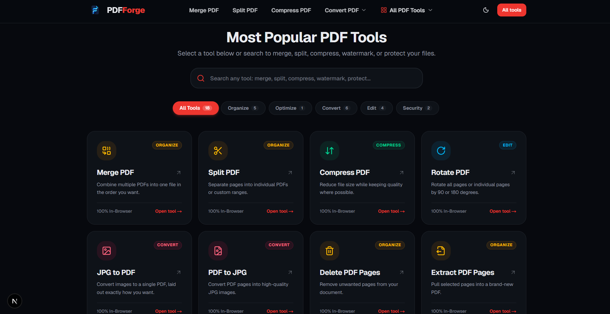

# PDFForge

Your PDF workspace — a fast, private, browser-based suite of PDF tools.

Merge, split, convert, compress, edit, and secure PDF files entirely on your device. Nothing is uploaded to a server, so your documents never leave your browser.



## Features

18 client-side tools, grouped by category:

**Organize**
- **Merge PDF** — combine multiple PDFs, drag to reorder
- **Split PDF** — single pages or custom ranges, ZIP output
- **Delete PDF Pages** — visually pick pages to remove
- **Extract PDF Pages** — new PDF from selected pages or ranges
- **Reorder PDF Pages** — drag-and-drop page arrangement

**Convert**
- **JPG to PDF** — images into one PDF with full layout control
- **WebP to PDF** — modern WebP images to PDF
- **PNG to PDF** — transparent/high-res PNGs to PDF
- **PDF to JPG** — pages to JPG with quality control
- **PDF to PNG** — lossless page export with adjustable DPI
- **PDF to Text** — extract readable text, preview and download

**Edit**
- **Rotate PDF** — per-page or all pages at 90°/180°
- **Page Numbers** — stamp numbers with custom position/format
- **Watermark PDF** — text watermarks with angle and opacity
- **Sign PDF** — draw, type, or upload a signature

**Security**
- **Protect PDF** — real password encryption
- **Unlock PDF** — remove passwords and restrictions

**Compress**
- **Compress PDF** — reduce file size with honest, measured results

## Tech Stack

- **Next.js 16** (App Router) + **React 19**
- **TypeScript** (strict)
- **Tailwind CSS 4** with CSS-variable design tokens (light/dark/system)
- **pdf-lib** + **pdf-lib-with-encrypt** for PDF manipulation and encryption
- **pdfjs-dist** for rendering and previews
- **jszip** for multi-file ZIP downloads
- **zod** for validation
- **lucide-react** icons, **Radix UI** primitives

## Getting Started

Install dependencies and start the dev server:

```bash
npm install
npm run dev
```

Open [http://localhost:3000](http://localhost:3000).

### Environment

Copy `.env.example` to `.env` and set your public URL:

```bash
NEXT_PUBLIC_APP_URL=http://localhost:3000
```

### Scripts

```bash
npm run dev     # start development server
npm run build   # production build
npm run start   # serve production build
npm run lint    # run ESLint
```

## Architecture

Every tool is a thin page over a shared toolkit, so behavior stays consistent.

- `src/config/tools.ts` — the tool registry (slug, name, category, icon, extensions, SEO metadata). Tool cards, navigation, and per-tool routes are generated from it.
- `src/lib/pdf/` — pure PDF operations: `merge`, `split`, `extract`, `delete-pages`, `rotate`, `reorder`, `images-to-pdf`, `pdf-to-images`, `pdf-to-png`, `encrypt`, `unlock`, `compress`, `watermark`, `page-numbers`, `sign-pdf`, `extract-text`, plus `document.ts` and the shared `pdfjs` setup.
- `src/components/tool/` — the reusable tool flow: `ToolHeader → UploadZone → FileList → ConfigurationPanel → ProcessingState → ResultPanel`.
- `src/lib/use-pdf-tool.ts` — the processing state machine (`idle → selected → validating → processing → completed/error`) with progress messages and cleanup.
- `src/app/tools/[slug]/page.tsx` — dynamic tool route rendering the tool bound to a registry entry.

## Privacy & Security

- **Client-side processing.** Files are read and transformed in the browser; they are not uploaded or stored.
- **Real validation.** File size and MIME type checks (never extension-only), sanitized filenames, and typed, human-readable errors with no stack traces.
- **Real encryption.** Protect uses genuine PDF standard encryption — no placeholder behavior.
- Object URLs are cleaned up, and large files are handled with browser memory in mind.

## Roadmap

Deliberately out of scope for now (architecture only, never faked):

- Accounts and history (Auth.js + database)
- Server-side heavy processing (OCR, PDF → Word/Excel/PPT, advanced compression)
- A full in-browser PDF editor
- Pricing and admin dashboard
